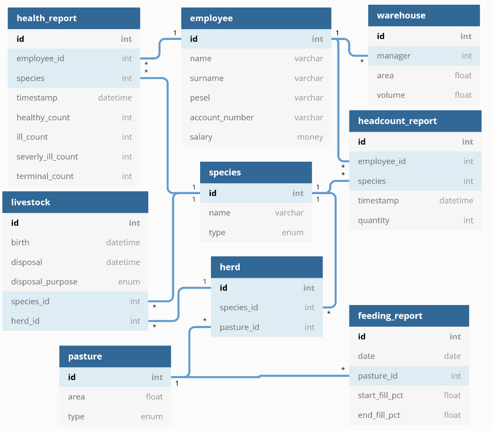

# Farm Database Generator

This is a generator for example data for a database of a farm; for the intent of generating a data source for a data warehouse project.

## How To Run

Install cargo, then simply `cargo run`. 

## Generated data

If everything went well the `out` directory should contain snapshot directories with the csv files of the generated data. Each of them corresponds to the tables with the same name from this model:

The headcount_report and livestock tables are independent.